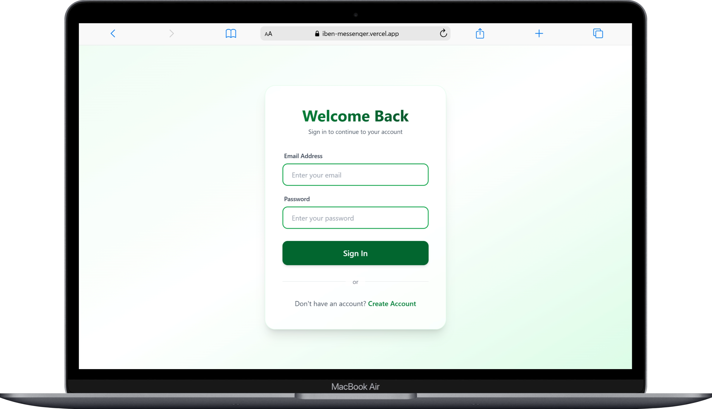
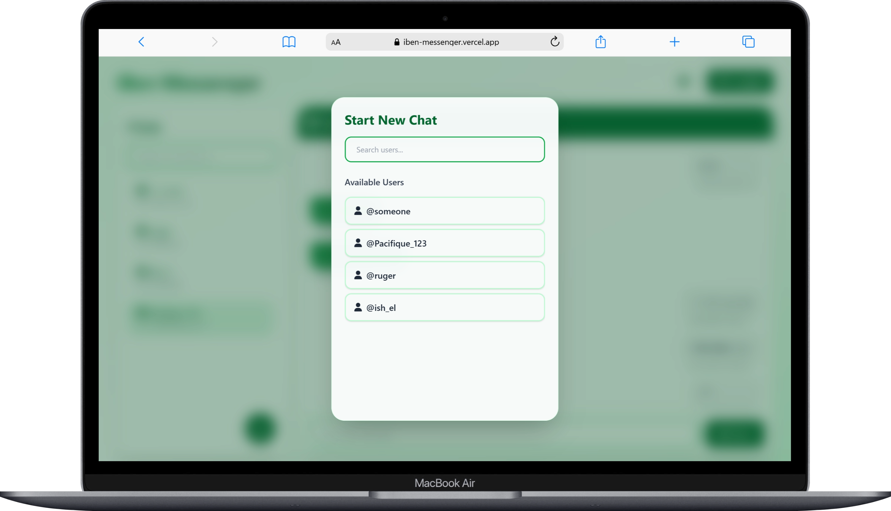
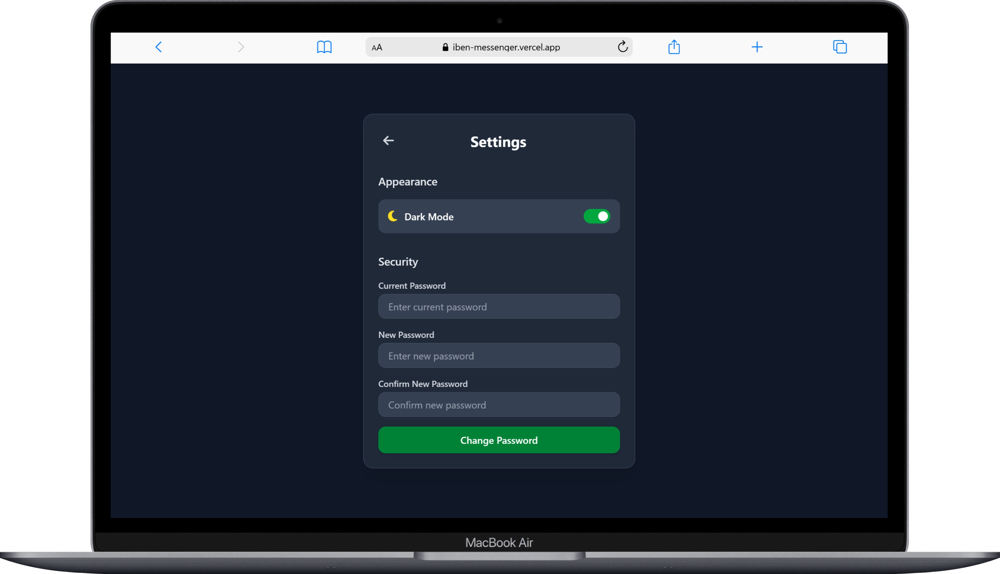

# Messenger App

A real-time messaging application built with React, Firebase, and Tailwind CSS. This application allows users to sign up, log in, and chat with other users in real-time. It features a modern, responsive UI with dark/light mode support.

## Features

-   **User Authentication**: Sign up and login using Firebase Auth.
-   **Real-time Messaging**: Send and receive messages instantly using Firebase Firestore.
-   **Responsive Design**: optimized for both desktop and mobile devices.
-   **Theme Toggle**: Switch between dark and light modes.
-   **Search Functionality**: Find users to start chatting with.

## Tech Stack

-   **Frontend**: React (with Vite)
-   **Styling**: Tailwind CSS
-   **Backend/Database**: Firebase (Auth, Firestore)
-   **Routing**: React Router DOM

## Prerequisites

Before you begin, ensure you have met the following requirements:

-   Node.js (v14 or higher) installed on your machine.
-   npm package manager.
-   A Firebase project set up with Authentication and Firestore enabled.

## Installation

1.  **Clone the repository:**

    ```bash
    git clone https://github.com/Itanga1/messenger-app.git
    cd messenger-app
    ```

2.  **Install dependencies:**

    ```bash
    npm install
    ```

3.  **Set up Environment Variables:**

    Create a `.env.local` file in the root directory and add your Firebase configuration keys:

    ```env
    VITE_FIREBASE_API_KEY=your_api_key
    VITE_AUTH_DOMAIN=your_auth_domain
    VITE_PROJECT_ID=your_project_id
    VITE_STORAGE_BUCKET=your_storage_bucket
    VITE_MESSAGING_SENDER_ID=your_messaging_sender_id
    VITE_APP_ID=your_app_id
    ```

## Usage

1.  **Start the development server:**

    ```bash
    npm run dev
    ```

2.  **Build for production:**

    ```bash
    npm run build
    ```

3.  **Preview production build:**

    ```bash
    npm run preview
    ```

## Screenshots

### Login Page



### Signup Page


### Home Page (Chat Interface)


### New Chat Form



### Settings Page


